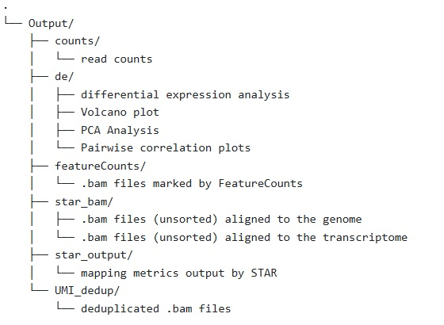

 
# Nextflow-RNA-Seq
<i>An RNA-Seq analysis pipeline written in Nextflow</i>

## Overview:
The pipeline starts with fastq mapping and ends with differential expression results. I modelled it after the nf-core RNA-seq pipeline, but trimmed it down to function as a <i>specific</i> workflow rather than an all-purpose toolkit. A docker container is provided. All code was written entirely by me.

Assumptions before starting:
- Your reads are paired-end and pre-cleaned
- Your reads have UMIs
- You have two groups (i.e. control vs. test) for differential expression analysis

Processing Overview:
- <b>Mapping</b> - RNA-STAR 
- <b>Duplicate Read Removal</b> - UMI Tools 
- <b>Read Counts</b> - FeatureCounts 
- <b>Differential Expression Analysis</b> - DESeq2

Pre-Run Overview:
- You must start with pre-cleaned <b>paired-end</b> fastq files. It will not work with SE fastq files. See my other fastq cleanup scripts if needed.
- You will be running mapRnaSeq.nf in the Docker container cbreuer/rnaseq:latest. Make sure you have Docker working. 
- You need four inputs: (4)
1) Metadata file with file names, locations, and control/test label (see the example template)
2) Your fastq files with names that match the expected filter (default is "<sample>_R1.fastq.gz" "<sample>_R2.fastq.gz")
3) A STAR genome index (see below)
4) A transcripts.gtf file

## Pre-Run Setup:
1) Edit nextflow.config:
- Indicate the strandedness of your library. Parameter: fc_strand. 0 = unstranded, 1 = stranded and 2 = reversely stranded
- Set up your output folder tree as you like
2) Ensure the fastq naming convention matches your files. 
- Config top line default is "_R1.fastq.gz" and "R2.fastq.gz".
- Names can only have one "_". They should look like <i>"sample1_R1.fastq.gz"</i> and <i>"sample1_R2.fastq.gz"</i>.
3) Build a STAR genome or download one from [iGenomes](s3://ngi-igenomes/igenomes/Homo_sapiens/NCBI/GRCh38Decoy/Sequence/STARIndex/).
4) Download the transcripts.fasta file for your genome. Example: [Human HG38 Release48](https://ftp.ebi.ac.uk/pub/databases/gencode/Gencode_human/release_48/gencode.v48.transcripts.fa.gz) from GenCode.
5) Use Docker pull to download the cbreuer/rnaseq container

## Run
- Place your customized metadata file, fastq files, scripts, and STAR genome in local folders - I like to use WSL. Ensure file locations are indicated correctlyl in the nextflow.config file.
- Run "nextflow MapRnaSeq.nf". This will automatically launch the pipeline within the docker container and publish the results to your local folder.

## Outputs
1) A file tree with outputs from each process: 
 

Output files include:
1) Differential expression analysis
- Test vs. Control expression results with Log2FC, p-value, and adjusted p-value. Note: the adjusted p-value significance cutoff can be set at the top of the DESeq2.R script if needed. Default is 0.05.
- Volcano plot (-log10 p-value vs. Log2 FC). 
- Significant genes list
2) .Bam files
- Before and after de-duplication using UMIs
3) All other intermdediate files (countsMatrix, bam indices, etc.)