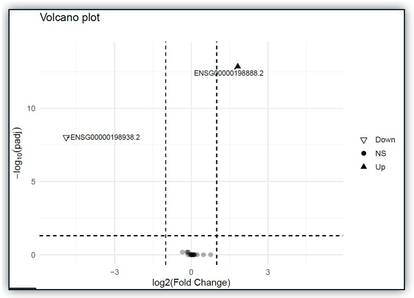

 
# Nextflow-RNA-Seq Pipelines
<i>Written in Nextflow for PE reads</i>

## Overview:
These pipelines include fastq mapping and through differential expression analysis. I modeled them after nf-core's RNA-seq pipeline, but trimmed them down to function as a <i>specific</i> workflows rather than combining them into one all-purpose toolkit. This reduces errors due to runtime setting mistakes (IMHO). The included Docker container can run either pipeline. All code was written entirely by me.

## Requirements:
- Your reads are paired-end and pre-cleaned
- Your reads can UMIs (or not)
- There are two DE groups (i.e. control vs. test)

## Processing Overview:
- <b>Mapping</b> - RNA-STAR 
- <b>Duplicate Read Removal</b> - UMI Tools 
- <b>Read Counts</b> - FeatureCounts 
- <b>Differential Expression Analysis</b> - DESeq2

## Pipeline Selection:
- RnaSeq_PE is for PE reads without cell or UMI barcodes. It does not perform a deduplication step.
- RnaSeq_PE_UMI.nf is for PE reads <b>with</b> UMI barcodes. It de-duplicates alignments using UMI-tools dedup.

## Pre-Run Overview:
- You must start with pre-cleaned <b>paired-end</b> fastq files. These pipeliens will not work with SE fastq files. See my other fastq cleanup scripts if needed.
- You will be running either RnaSeq_PE.nf or RnaSeq_PE_UMI.nf in the Docker container cbreuer/rnaseq:latest. Make sure you have the Docker container pulled and working before you start. 
- Inputs: (4)
1) <b>Metadata file</b> with file names, locations, and control/test label (see the example template)
2) <b>Fastq files</b> with names that match the expected filter (default is "<sample>_R1.fastq.gz" "<sample>_R2.fastq.gz")
3) <b>STAR genome index </b> (see below)
4) <b>Transcripts.gtf file</b>

## Pre-Run Setup:
1) Edit nextflow.config:
- Indicate the strandedness of your library. Parameter: fc_strand. 0 = unstranded, 1 = stranded and 2 = reversely stranded
- Set up your output folder tree as you like
2) Ensure the fastq naming convention matches your files. 
- Default is "_R1.fastq.gz" and "R2.fastq.gz".
- File names can only have one "_". They should look like <i>"sample1_R1.fastq.gz"</i> and <i>"sample1_R2.fastq.gz"</i>.
3) Build a STAR genome or download one from [iGenomes](s3://ngi-igenomes/igenomes/Homo_sapiens/NCBI/GRCh38Decoy/Sequence/STARIndex/).
4) Download the transcripts.fasta file for your genome. Example: [Human HG38 Release48](https://ftp.ebi.ac.uk/pub/databases/gencode/Gencode_human/release_48/gencode.v48.transcripts.fa.gz) from GenCode.
5) Use Docker pull to download <b>cbreuer/rnaseq:latest</b>

## Run
- Place your customized metadata file, fastq files, scripts, and STAR genome in local folders - I like to use WSL. Ensure file locations are indicated correctly in the nextflow.config file.
- Run "nextflow MapRnaSeq.nf". This will automatically launch the pipeline in docker container cbreuer/rnaseq and publish the results to your local folder.

## Outputs
### A file tree with outputs from each process: 
 

### Differential expression analysis table
   
### Differential expression results with Log2FC, p-value, and adjusted p-value (test vs control)
- Note: the adjusted p-value significance cutoff can be set at the top of the DESeq2.R script if needed. Default is 0.05. 
- A basic Volcano plot (-log10 p-value vs. Log2 FC).  
   
- A filtered table of significant genes  
### All aligned (.bam) files
- Before and after de-duplication (using UMIs) bam files  
### All other intermdediate files 
- countsMatrix
- bam indices
- etc...